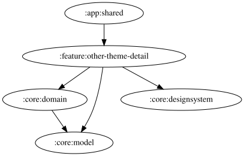

# other-theme-detail

<!-- MODULE-GRAPH-START -->
## Module Dependencies

<!-- MODULE-GRAPH-END -->

「その他」のテーマダイアログでラジオボタンを選ぶと、アプリ全体とダイアログのテーマを即座にプレビューする。選択中は保存せず、OKで確定・保存する。キャンセル、ダイアログ外のタップ、戻る操作ではプレビューを解除し、保存済みのテーマへ戻す。確定時は保存済み状態に反映されるまでプレビューを維持する。
