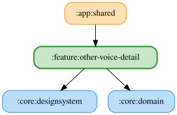

# other-voice-detail

Windows/Androidの音声選択画面。システム既定と、それ以外の日本語の音声をカードで選択し、即時保存する。取得中は「読み込み中…」の文言、空の一覧では音声追加の案内と再読み込みを表示する。保存済みIDが不在の場合は保存値を保持し、システム既定を選択表示する。

GetAvailableVoicesUseCase・ObserveVoiceUseCase・SaveVoiceUseCaseを使用する。Repositoryはcore:dataとcore:text-to-speech-dataのJVM実装に依存する。SpeakTextUseCase・ObserveSoundVolumeUseCaseで各カード右端の再生ボタンから、そのカードの音声IDで試聴できる（選択・保存は変更しない）。既定と件数付きの日本語音声のセクションを表示し、広いペインは2列、狭いペインは1列に配置する。取得中はカードを表示せず、音量が0以下なら読み上げない。試聴中のカードは再生アイコンの代わりに3本のバーが動くイコライザーを表示する。同じボタンを再タップすると停止し、別のカードのボタンを押すと前の試聴を停止して切り替える。完了・失敗・キャンセルで通常の再生アイコンに戻る。試聴に失敗しても画面の操作は継続できる。指定音声が見つからない場合は日本語音声へフォールバックする。

<!-- MODULE-GRAPH-START -->
## Module Dependencies

<!-- MODULE-GRAPH-END -->

システム既定の音声は日本語の音声一覧・件数から除外する。除外した音声のIDが保存済みの場合は保存値を保持し、既定カードを選択表示する。既定音声だけが利用できる場合は、追加の日本語音声がない旨を表示する。
