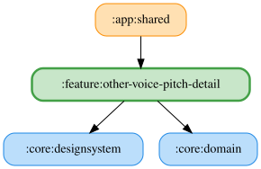

# other-voice-pitch-detail

声の高さを0.5〜2.0倍の範囲で0.1刻みに設定する詳細ペイン。スライダーの操作完了時に保存し、デフォルトの1.0倍へリセットできる。

`ObserveVoicePitchUseCase` で保存済みのピッチを監視し、`SaveVoicePitchUseCase` で保存する。KoinモジュールはこれらのUseCaseを提供し、`:core:data`の`VoicePitchPreferencesRepository`を消費する。設定はDataStoreに永続化される。

保存したピッチは `SpeakTextUseCase` 経由で読み上げに反映される。

<!-- MODULE-GRAPH-START -->
## Module Dependencies

<!-- MODULE-GRAPH-END -->
