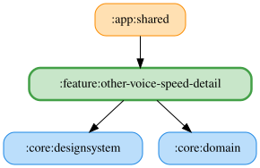

# other-voice-speed-detail

読み上げ速度を0.5〜2.0倍の範囲で0.1刻みに設定する詳細ペイン。操作完了時に保存し、デフォルトの1.0倍へリセットできる。

`ObserveVoiceSpeedUseCase` で保存済みの速度を監視し、`SaveVoiceSpeedUseCase` で保存する。Koinモジュールは両UseCaseを提供し、`:core:data`の`VoiceSpeedPreferencesRepository`を消費する。設定はDataStoreに永続化される。

<!-- MODULE-GRAPH-START -->
## Module Dependencies

<!-- MODULE-GRAPH-END -->
