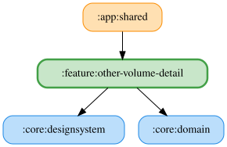

# other-volume-detail

音量の試聴は、読み上げ速度と同じ再生アイコン付きの「試聴」ボタンを使う。
保存・音量取得の待機中から停止アイコン付きの「停止」に切り替わり、再タップまたはペイン離脱で停止する。
直前のアプリ音量の保存完了を待ち、保存済みの音量・音声・読み上げ速度・声の高さで
従来の自己ベストラップの既定文言を試聴する。アプリ音量が0なら再生しない。

<!-- MODULE-GRAPH-START -->
## Module Dependencies

<!-- MODULE-GRAPH-END -->
