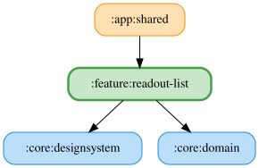

# readout-list

アナウンス設定一覧画面（設定できる読み上げ項目の一覧・並び替え・有効無効切り替え）を提供する feature モジュール。

## 主要なファイルの役割

- `ReadoutListPane.kt` / `ReadoutContent.kt`: 一覧画面のUI。`ReadoutContent.kt` は `Material3 Adaptive` の `ListDetailPaneScaffold` と `ReadoutNavigationState`（Navigation 3の `NavBackStack`）を組み合わせて list/detail ペインの表示切り替えを行う（詳細パターンは `docs/list-detail-navigation-pattern.md` を参照）。
- `ReadoutDetailPane.kt`: 選択した読み上げ項目の詳細設定画面。
- `ReadoutListViewModel.kt`: シミュレーターごとの読み上げ項目一覧・並び順・有効状態を `StateFlow` で公開する。並び替え中はローカルの `LocalOrderState` で楽観的に状態を保持し、確定時に `SaveReadoutOrderUseCase` へ反映する。
- `ReadoutListModule.kt`: この feature の Koin モジュール定義。
- `ReadoutItemDisplayName.kt`: `ReadoutItemKey`（ASCIIの内部ID）から画面表示名への変換。
- `ReadoutListItemType.kt`: 一覧に表示する行の種別（通常項目 / 見出し等）を表す型。
- `ReadoutListHints.kt`: 一覧画面のヒント表示（初回操作案内等）。

<!-- MODULE-GRAPH-START -->
## Module Dependencies

<!-- MODULE-GRAPH-END -->
