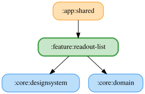

# readout-list

アナウンス設定一覧画面（設定できる読み上げ項目の一覧・並び替え・有効無効切り替え）を提供する feature モジュール。

## 主要なファイルの役割

- `ReadoutListPane.kt` / `ReadoutContent.kt`: 一覧画面のUI。`ReadoutContent.kt` は `Material3 Adaptive` の `ListDetailPaneScaffold` と `ReadoutNavigationState`（Navigation 3の `NavBackStack`）を組み合わせて list/detail ペインの表示切り替えを行う（詳細パターンは `docs/list-detail-navigation-pattern.md` を参照）。
- `ReadoutDetailPane.kt`: 選択した読み上げ項目の詳細設定画面。一覧側の Root スイッチ（`ReadoutItemKey.*.Root`）がOFFの場合は、画面上部に警告バナー（左端に縦方向中央の警告アイコン、中央にメッセージ、右端に Root を有効化する「ONにする」リンク）を表示し、詳細内容全体を薄く表示する（操作は可能なまま、保存値は変更しない）。バナーの表示・非表示は縦方向の展開とフェードでアニメーションする。詳細内容の透明度も滑らかに変化する。バナー全体がタップ領域となり、タップすると Root を有効化する。波紋はバナーの角丸内に表示する。各 detail モジュール側の変更は不要。
- `ReadoutListViewModel.kt`: シミュレーターごとの読み上げ項目一覧・並び順・有効状態を `StateFlow` で公開する。並び替え中はローカルの `LocalOrderState` で楽観的に状態を保持し、確定時に `SaveReadoutOrderUseCase` へ反映する。
- `ReadoutListModule.kt`: この feature の Koin モジュール定義。
- `ReadoutItemDisplayName.kt`: `ReadoutItemKey`（ASCIIの内部ID）から画面表示名への変換。
- `ReadoutListItemType.kt`: 一覧に表示する行の種別（通常項目 / 見出し等）を表す型。
- `LmuWindowsReadoutListItemType.kt` / `Gt7Ps5ReadoutListItemType.kt` / `AceWindowsReadoutListItemType.kt`: `ReadoutListItemType` のシミュレータ別サブクラス（項目定義とキーからの逆引き）。
- `ReadoutListHints.kt`: 一覧画面のヒント表示（初回操作案内等）。

読み上げ優先度のヘルプでは、キューOFF時の割り込み・省略条件と、キューON時は優先順位に関係なく順番待ちすることを説明する。ヘルプ全体は縦スクロールに対応し、低い画面や大きな文字設定でも末尾まで読める。

読み上げ有効状態が未読み込み、または設定にRootキーが存在しない場合は、一覧のスイッチと詳細画面のRoot有効状態に `:core:domain` の `READOUT_ENABLED_STATE_DEFAULT` を使用する。

<!-- MODULE-GRAPH-START -->
## Module Dependencies

<!-- MODULE-GRAPH-END -->

ACEのデフォルト優先度は、フラッグ → 車両接近 → 燃料残り周回数 → 燃料残量 → タイヤ温度 → 自己ベストラップの順。保存済みの並び順がある場合はそちらを優先し、一覧とNarratorで同じ実効順序を使用する。
