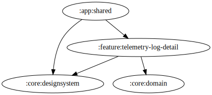

# telemetry-log-detail

テレメトリログ詳細を表示する Feature モジュール。

現時点では詳細ペイン全体に空の `LazyColumn` を表示し、`TelemetryLogDetailViewModel` が `uiState` を公開する。

<!-- MODULE-GRAPH-START -->
## Module Dependencies

<!-- MODULE-GRAPH-END -->
