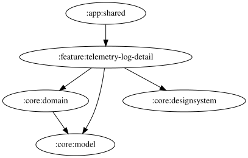

# telemetry-log-detail

テレメトリログ詳細を表示する Feature モジュール。

`TelemetryLogDetailViewModel` が選択したログIDをもとに `ObserveTelemetryLogDetailUseCase` を購読し、`uiState` を公開する。`TelemetryLogDetailContent` は `LazyColumn` に選択したログのテレメトリJSONと、一つ前のログがある場合はそのJSONを表示する。

<!-- MODULE-GRAPH-START -->
## Module Dependencies

<!-- MODULE-GRAPH-END -->
