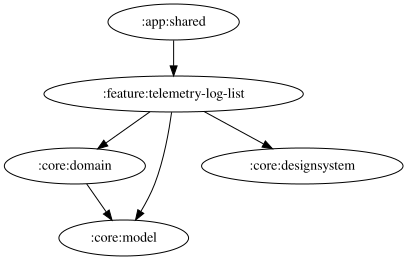

# telemetry-log-list

記録済みテレメトリログの一覧画面を提供する feature モジュール。

## 主要なファイルの役割

- `TelemetryLogListPane.kt` / `TelemetryLogContent.kt`: 一覧画面のUI。`TelemetryLogContent.kt` は `ReadoutContent.kt`（`feature:readout-list`）・`OtherContent.kt`（`app:shared`）と同様に `Material3 Adaptive` の `ListDetailPaneScaffold` と `TelemetryLogNavigationState`（Navigation 3の `NavBackStack`）を組み合わせるパターンを使う（詳細は `docs/list-detail-navigation-pattern.md` を参照）。
- `TelemetryLogListViewModel.kt`: ログ一覧・選択中ログ・削除確認ダイアログ表示状態などを `StateFlow` で公開する。
- `ObserveSortedTelemetryLogsUseCase.kt`: `:core:domain` の `ObserveTelemetryLogsUseCase` を作成日時の降順にソートして提供する、この feature 固有のUseCase。
- `TelemetryLogListModule.kt`: この feature の Koin モジュール定義。
- `TelemetryLogDeleteConfirmDialog.kt` / `TelemetryLogResetConfirmDialog.kt`: 個別削除・全件リセット時の確認ダイアログ。
- `ReadoutItemDisplayName.kt`: ログに紐づく `ReadoutItemKey` の表示名変換。
- `ErrorCapture.kt`: プラットフォームごとのエラーレポート送信（expect/actual）。

<!-- MODULE-GRAPH-START -->
## Module Dependencies

<!-- MODULE-GRAPH-END -->
