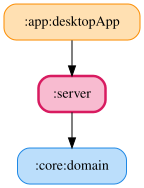

# server

デスクトップアプリ内で Windows 版と同一プロセスで起動する Ktor WebSocket サーバー。`0.0.0.0:8080` で待ち受ける。

## WebSocket エンドポイント

WebSocket エンドポイントは `/ws/<Simulator.id>/<feature>` のパターンに従う（例: `/ws/lmu_windows/flags`）。`/ws/<Simulator.id>/flags` は `ObserveLmuWindowsRaceFlagsUseCase` を通じて `LmuWindowsFlagRepository` を購読し、`LmuWindowsRaceFlagsData` を JSON として送信する。同一内容の連続値は送信しない。

LAN 内の Android 端末からは `ws://<Windows PC のローカル IP>:8080/ws/<Simulator.id>/flags` 等へ接続する。外部端末から接続するには Windows ファイアウォールで TCP 8080 番ポートの受信を許可する必要がある場合がある。現時点では認証・暗号化を実装していないため、信頼できる LAN 内でのみ使用すること。

`src/main/kotlin/kurou/kodriver/TelemetryWebSocket.kt` の `telemetryWebSocket` は、WebSocket 接続に `Origin` ヘッダが含まれる場合は `CloseReason.Codes.VIOLATED_POLICY` で切断する。WebSocket はブラウザの CORS（Same-Origin Policy）の対象外のため、LAN 内の別端末で開かれた悪意あるページの JavaScript から接続されてテレメトリ情報を読み取られる恐れがある（CSWSH: Cross-Site WebSocket Hijacking）。Android アプリ等のネイティブクライアントは通常 `Origin` ヘッダを送らないため接続に影響しない。

## mDNS 広告（サーバー自動検出）

`KoDriverServer.start()` は Ktor サーバー起動と同時に `KoDriverServiceAdvertiser`（`javax.jmdns.JmDNS` によるラッパー）でサービスタイプ `_kodriver._tcp.local.`（`core:domain` の `MdnsConstants.KO_DRIVER_SERVICE_TYPE` として `:server` と `:feature:other-server-ip-detail`（JVM 実装）から共有）を LAN 内へ mDNS 広告する。インスタンス名にはホスト名を使用し、複数台の Windows PC が同一 LAN 上で起動している場合でも Android 側がホスト名で区別できるようにしている。ホスト名が FQDN（ドット区切り）で返る環境向けに、ドット以降を除去してから使用する。`start()` は呼び出しごとに既存の `JmDNS` インスタンスを `stop()` してから新規生成するため、多重起動してもソケットはリークしない。mDNS の登録・解除に失敗しても（`IOException`）ログ出力のみで Ktor サーバー自体の起動・停止は妨げない。

`:feature:other-server-ip-detail` の接続先 IP 入力画面（detailPane）は、画面が表示されている間だけ `WindowsServerDiscovery`（プラットフォーム実装: JVM は JmDNS、Android は `NsdManager`）で上記の mDNS 広告を検出する。`OtherServerIpDetailViewModel` は検出結果を `SharingStarted.WhileSubscribed` で `uiState` の購読に連動させており、アプリ起動時ではなく detailPane 表示中のみ検出が動作する。検出できた場合はホスト名・IP アドレスを選べるダイアログを自動表示し、「選択する」で選択した IP アドレスを入力欄へ自動入力する。

<!-- MODULE-GRAPH-START -->
## Module Dependencies

<!-- MODULE-GRAPH-END -->
